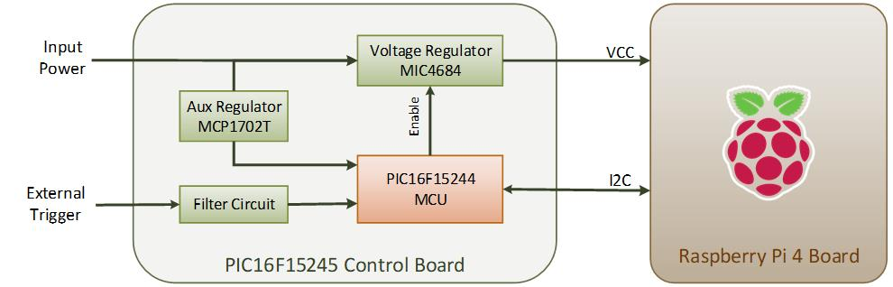

<!-- Please do not change this html logo with link -->

# System Power Supply Control Module using PIC16F15245 Microcontroller

## Introduction

This code example demonstrates system power supply control for the Raspberry Pi based application using PIC16F15245 Control board. For more details refer section 6 “Appendix: System Power Supply Control for the Raspberry Pi Application” of application note “Using PIC16F15244 Microcontrollers for System Power Supply Control”, which provides implementation and demonstration details based on Raspberry pi board.

For PIC16F15244 Curiosity Nano kit based implementation, refer “Supply Control Module using PIC16F15244 Microcontroller” and “Process Computer Module using PIC16F15244 Microcontroller” GitHub code examples. 

## Related Documentation

- [Application note : Using PIC16F15244 Microcontrollers for System Power Supply Control]
- [GitHub Microchip PIC Examples : Supply Control Module using PIC16F15244 Microcontroller]
- [GitHub Microchip PIC Examples : Process Computer Module using PIC16F15244 Microcontroller]
- [PIC16F15244 Product Family Page](https://www.microchip.com/en-us/products/microcontrollers-and-microprocessors/8-bit-mcus/pic-mcus/pic16f15244)
- [PIC16F15244 Code Examples on GitHub](https://github.com/microchip-pic-avr-examples?q=pic16f15244&type=&language=&sort=)
- [PIC16F15244 MCU Family Video](https://www.youtube.com/watch?v=nHLv3Th-o-s)
- [PIC16F15244 MCU Product Page](https://www.microchip.com/en-us/product/PIC16F15244)

## Demo Description

In this demonstration, PIC16F15245 control board is referred as supply control module which controls the power consumption of the Raspberry Pi board when it needs to be put in Power-Down mode. A dedicated hardware board with a PIC16F15245 microcontroller and a MIC4684 switching regulator with enable control is used for power control of the Raspberry Pi board. The hardware also contains one MCP1702T low-dropout regulator to power the PIC16F15245 microcontroller. Below figure shows the block diagram of the hardware connections for the demonstration.

  

## Software Used

- [MPLAB® X IDE 6.00 or newer](http://www.microchip.com/mplab/mplab-x-ide)
- [MPLAB® XC8 2.36 or a newer compiler](http://www.microchip.com/mplab/compilers)
- [MPLAB® Code Configurator (MCC) 5.1.1 or newer](https://www.microchip.com/mplab/mplab-code-configurator)
- MCC Melody Core 2.1.9
- Timer0 (TMR0) MCC Melody driver v4.0.8

## Hardware Used

- PIC16F15244 Curiosity Nano Evaluation Kit [EV09Z19A](https://www.microchip.com/en-us/development-tool/EV09Z19A)

## Demo Setup:

  

## Demo Operation:

For demonstration PIC16F15245 Control board and Raspberry Pi 4 boards are used. Raspberry Pi board is programmed using python programming language and flash the program which is attached above the code example. Flash the firmware to the PIC16F15245 control board using MPLAB PICkit 4 programmer device. Connect keyboard externally to the Raspberry pi board through USB port, to enter power down command. The following points explains about functionality of the application.
1.	Enter the I2C command using keyboard connected to the Raspberry pi board. In this code example, command consists of an ASCII characters , for example: enter command  “S007200’” , character ‘S’ is for cross platform support and 7200 represents seconds or two hours of power down mode.
2.	Raspberry pi board transmits the I2C command to the PIC16F15245 control board through I2C peripheral.
3.	After transmitting the command, raspberry pi enters software shut down mode. 
4.	PIC16F15245 Control board waits for 30 secs before turning OFF the voltage regulator to the Raspberry pi board. 
5.	Once the waiting period is completed, PIC16F15245 control board turns OFF the voltage regulator to the Raspberry pi board and enters the sleep mode.
6.	After power down period is completed, PIC16F15245 control board wakes up from the sleep and enables the voltage regulator to the raspberry pi board.

## Conclusion:

This code example presents developers with an overview of how an 8-bit microcontroller can be used to improve the power consumption of a process computer, such as an SBC. As a use case for system power supply control Raspberry Pi based reference application is demonstrated here. 

 
